

  <h1 style="display: flex; align-items: center; justify-content: center; width: 100%;">
     신인 작가들을 위한 커뮤니티, Artego

  </h1>
<!--   <h3>소개란</h3> -->
  <h3>신인 작가들을 위한 커뮤니티, Artego</h3>
  
2025.04.06 ~ 2025.05.31
  
    
  <a href="https://indi-front.vercel.app">테스트 사이트</a>
  &nbsp; | &nbsp; 
  <a href="https://artego.swygbro.com">배포 사이트</a>
  &nbsp; | &nbsp; 
   <a href="./resources/pdf/ppt.pdf">발표 PPT</a>

## 📆 프로젝트 기간

### 25.04.06 ~ 25.05.31

- 기획 및 설계 : 25.04.06 ~ 25.04.21
- 최소 기능 제품(MVP) 구현 : 25.04.21 ~ 25.05.16
- 시나리오 테스트 : 25.05.16 ~ 25.05.18
- 추가 기능 구현 및 산출물 정리 : 25.05.19 ~ 25.05.31

 

## 목차

1. [개요](#개요)
2. [핵심 기능 소개](#핵심-기능-소개)
3. [서비스 소개](#서비스-소개)
4. [프로젝트 설계](#프로젝트-설계)
5. [개발 환경 및 기술 스택](#개발-환경-및-기술-스택)
6. [팀원 소개](#팀원-소개)

 

## [개요](#목차)

신진 작가가 겪는 문제점을 해결하기 위해 'Artego' 서비스를 제작했습니다.  
 
신진 작가들이 겪는 **문제점**은 다음과 같습니다.  
 
**1. 전시 공간 부족**

- 전시 공간은 대여 비용과 커넥션의 장벽이 존재합니다.

**2. 작품 노출의 한계**

- 인스타그램이나 블로그 같은 플랫폼에 올려도 금방 묻혀버리는 한계점이 있습니다.

**3. 낮은 접근성**

- 일반인들이 노력하지 않으면 신진 작가의 작품을 발견하고 감상할 수 있는 기회가 적습니다.

이런 문제를 해결하기 위해, 'Artego'에서는 작가의 작품을 한곳에 모아 보여줍니다.  
사용자들은 작품에 반응할 수 있으며, 작가는 사용자의 반응 데이터를 기반으로 자신의 시장성을 검증할 수 있습니다.
 
 

### **Artego란?**

‘Artego’는 **예술(Art)** 과 **자아(Ego)** 의 합성어로, 창작자의 철학과 감성을 담은 이름입니다.  
예술가 각자의 고유한 세계관과 표현을 존중하는 서비스를 지향하며, 그 정체성을 이름에 녹여냈습니다.

 
 

## [핵심 기능 소개](#목차)

### 1. 기능 소개

- 기능소개
- 기능소개

 

### 2. 작가등록

- **기능소개**: 기능소개

- **기능소개:** 기능소개

- **기능소개:** 기능소개

- **기능소개:** 기능소개

 
 

## [서비스 소개](#목차)

### 1️⃣ 메인 페이지

> 등록된 작품들을 카테고리 필터를 통해 필터링하여 확인하거나, 상단 네비바를 활용해 알림, 팔로우 등을 확인할 수 있습니다.

|                          **Lading Page**                           |
| :----------------------------------------------------------------: |
| 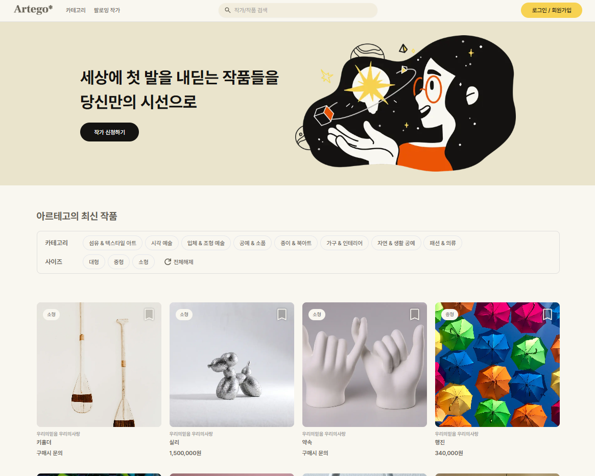 |

|                          **Login Popup**                          |                       **Artist Apply Popup**                       |
| :---------------------------------------------------------------: | :----------------------------------------------------------------: |
| 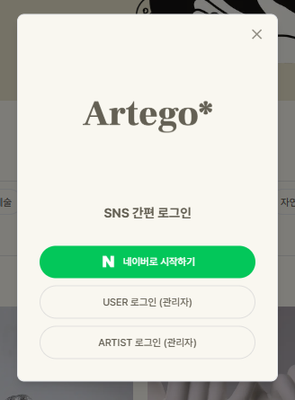 | 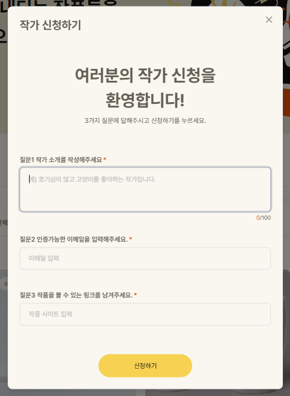 |

 

### 2️⃣ 검색 및 카테고리 페이지

> 상단 네비바를 통해 검색한 작품 결과를 확인하거나, 카테고리별 작품 목록을 확인할 수 있습니다.

|                          **Search Page**                          |                          **Category Page**                          |
| :---------------------------------------------------------------: | :-----------------------------------------------------------------: |
| 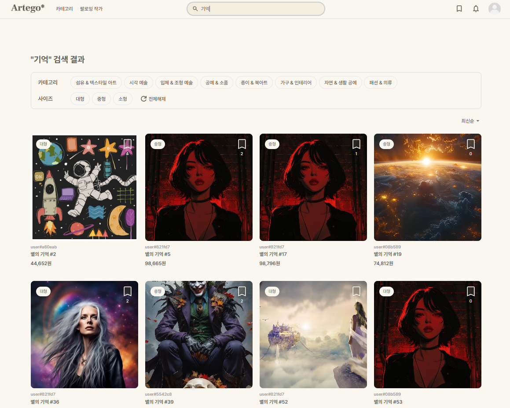 | 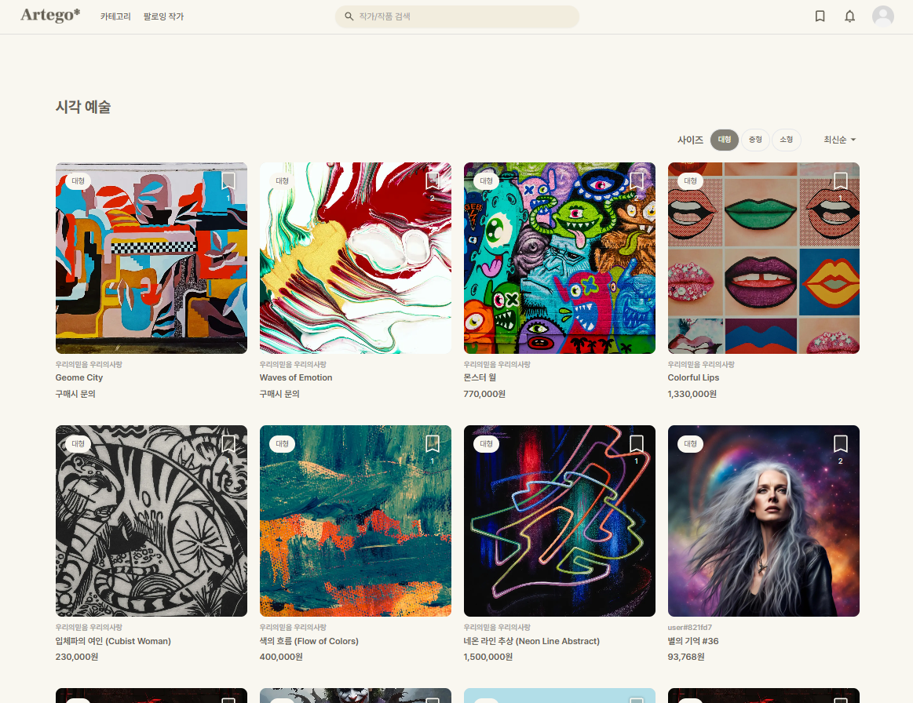 |

 

### 3️⃣ 작품 등록 및 수정 페이지

> 작가로 인증받은 유저에 한정하여 본인의 작품을 등록할 수 있습니다.

|                          **Item Register Page**                          |
| :----------------------------------------------------------------------: |
| 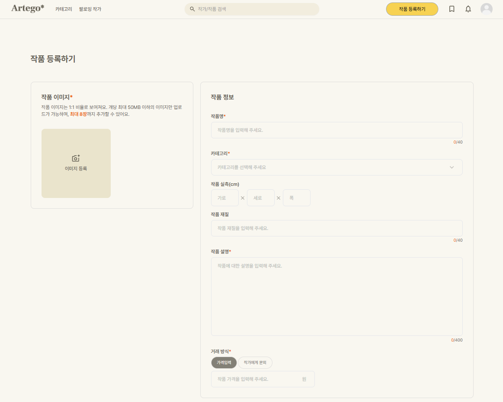 |

 

### 4️⃣ 마이 페이지

> 내 회원 정보를 수정하고, 내가 작성한 댓글을 확인할 수 있습니다.

|                        **My Page (user)**                         |                        **My Page (artist)**                         |
| :---------------------------------------------------------------: | :-----------------------------------------------------------------: |
| 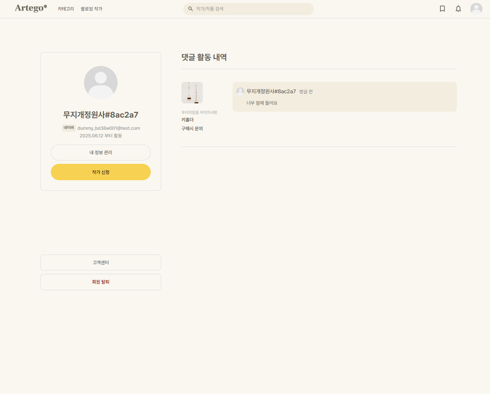 | 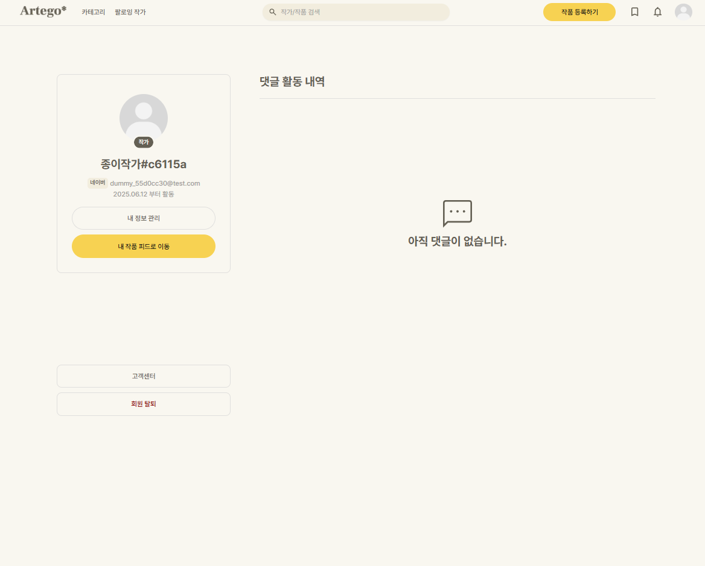 |

 

### 5️⃣ 스크랩 페이지

> 로그인 유저는 스크랩 버튼을 눌러 저장해 둔 작품을 확인할 수 있습니다.

|                          **Scrap Page**                          |
| :--------------------------------------------------------------: |
| 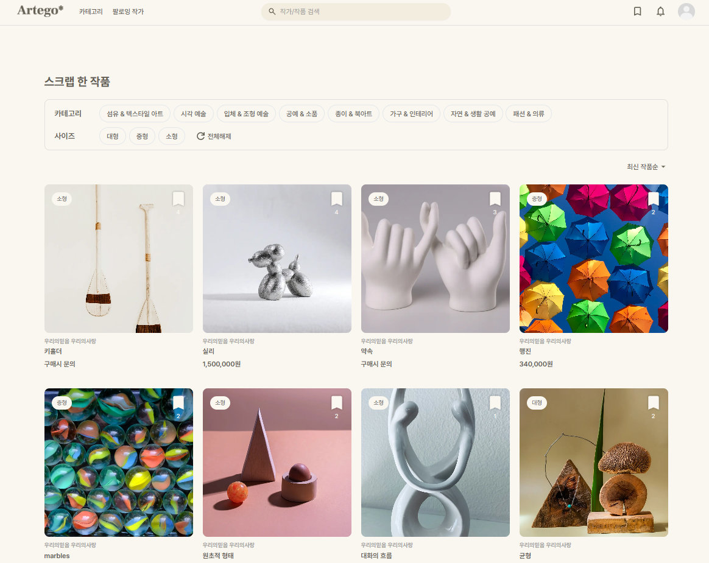 |

 

### 5️⃣ 작가 피드 페이지

> 작가의 작품과 작가의 작품들에 대한 전체적인 반응을 확인하고, 작가의 경우 본인 피드 페이지의 프로필을 관리할 수 있습니다.

|                          **Artist Page**                          |
| :---------------------------------------------------------------: |
|  |

 

### 6️⃣ 작품 상세 페이지

> 작품에 대한 상세 내용을 확인하고 작가와 유저가 댓글을 통해 소통할 수 있습니다.

|                         **Item Detail**                         |                           **Comment Section**                           |
| :-------------------------------------------------------------: | :---------------------------------------------------------------------: |
| 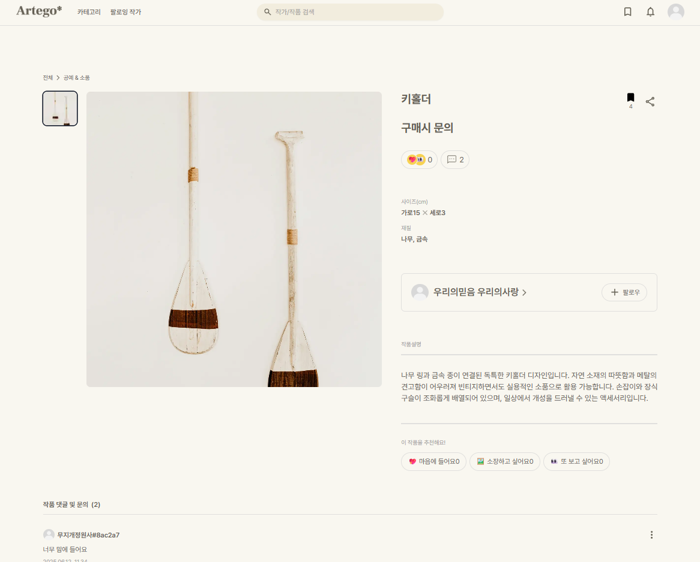 | 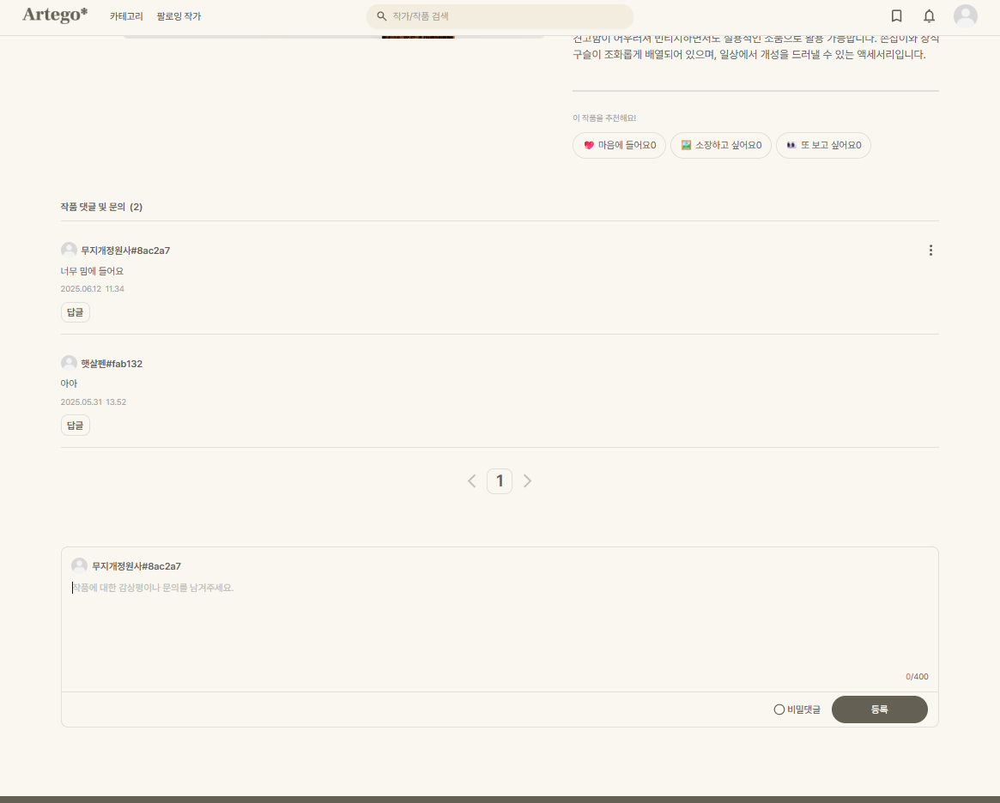 |

 

### 7️⃣ 팔로우 목록 페이지

> 내가 팔로우 한 작가들의 리스트와 해당 작가들의 작품 목록을 확인할 수 있습니다.

|                          **Follow Page**                          |
| :---------------------------------------------------------------: |
| 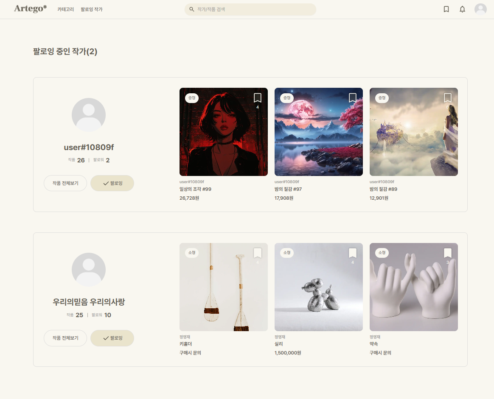 |

 
 

## [프로젝트 설계](#목차)

### 시스템 아키텍쳐

이미지 클릭 시 원본 사진의 경로로 이동합니다.

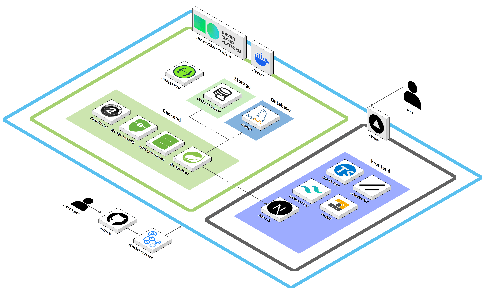

 

### ERD

이미지 클릭 시 원본 사진의 경로로 이동합니다.

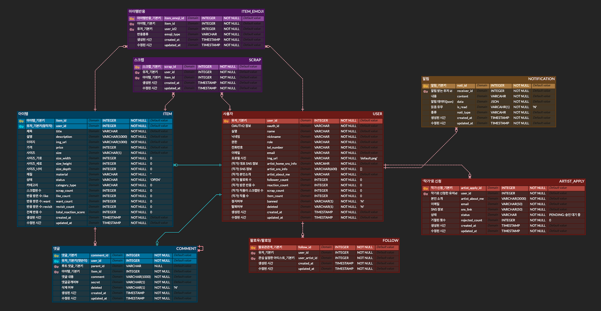

 
 

## [개발 환경 및 기술 스택](#목차)

|      개발 환경      | 기술 스택                                                                                                                                                                                                                                                                                                                                                                                                                                                                                                                                                                                                                                                                                        |
| :-----------------: | :----------------------------------------------------------------------------------------------------------------------------------------------------------------------------------------------------------------------------------------------------------------------------------------------------------------------------------------------------------------------------------------------------------------------------------------------------------------------------------------------------------------------------------------------------------------------------------------------------------------------------------------------------------------------------------------------- |
|    **Frontend**     |                                                                                                                                    |
|     **Backend**     |       |
|       **DB**        |                                                                                                                                                                                                                                                                                                                                                                                                                                                                                                                                                                                                |
|      **Infra**      |                                                                                                                                                                                                                                                                                                                                                                                                                                                              |
|   **Deployment**    |                                                                                                                                                                                                                                                                                                                                                                                                                                                                                                                                                                                             |
| **Management Tool** |                                  |

 
 

## [팀원 소개](#목차)

## **Contributors**

<table>
  <tr>
    <th>기획</th>
    <th colspan="2">디자이너</th>
  </tr>
  <tr>
    <td></td>
    <td></td>
    <td></td>
  </tr>
  <tr align="center">
    <td><b>정명재</b></td>
    <td><b>최영서</b></td>
    <td><b>이진</b></td>
  </tr>
</table>

<table>
  <tr>
    <th colspan="2">FE</th>
    <th>BE</th>
    <th>BE, Infra</th>
  </tr>
  <tr>
    <td></td>
    <td></td>
    <td></td>
    <td></td>
  </tr>
  <tr align="center">
    <td><b>이형준</b></td>
    <td><b>옥승현</b></td>
    <td><b>전영식</b></td>
    <td><b>윤서영</b></td>
  </tr>
  <tr align="center">
    <td><a href="https://github.com/leehj322">@leehj322</a></td>
    <td><a href="https://github.com/SeungHyunOK">@SeungHyunOK</a></td>
    <td><a href="https://github.com/dudtlr">@dudtlr</a></td>
    <td><a href="https://github.com/ytjdud">@ytjdud</a></td>
  </tr>
</table>
